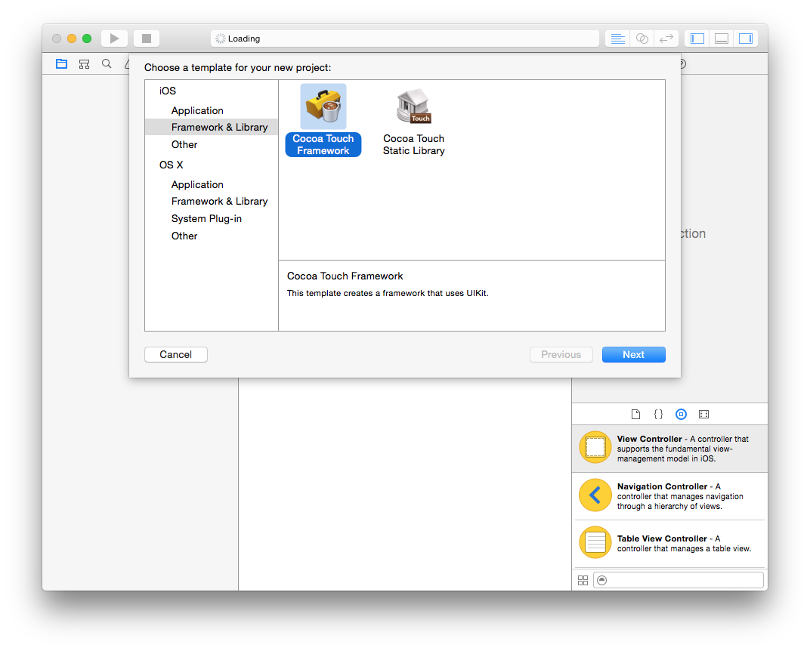
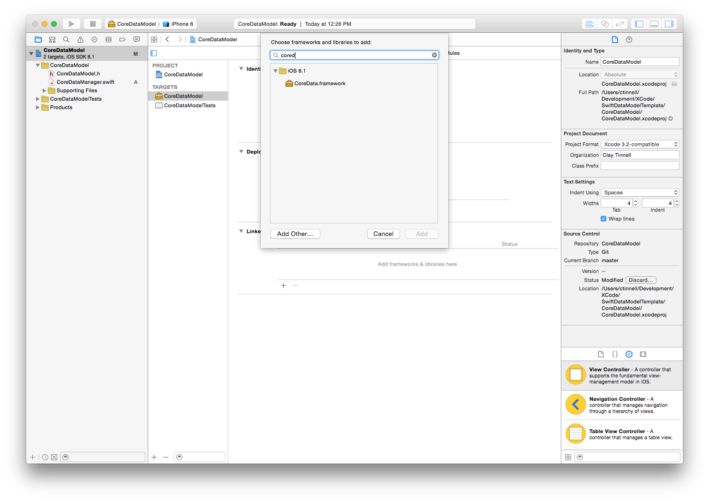
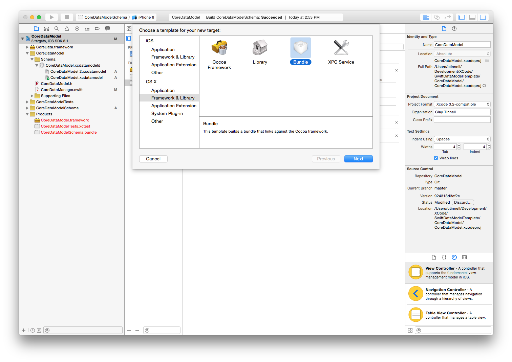
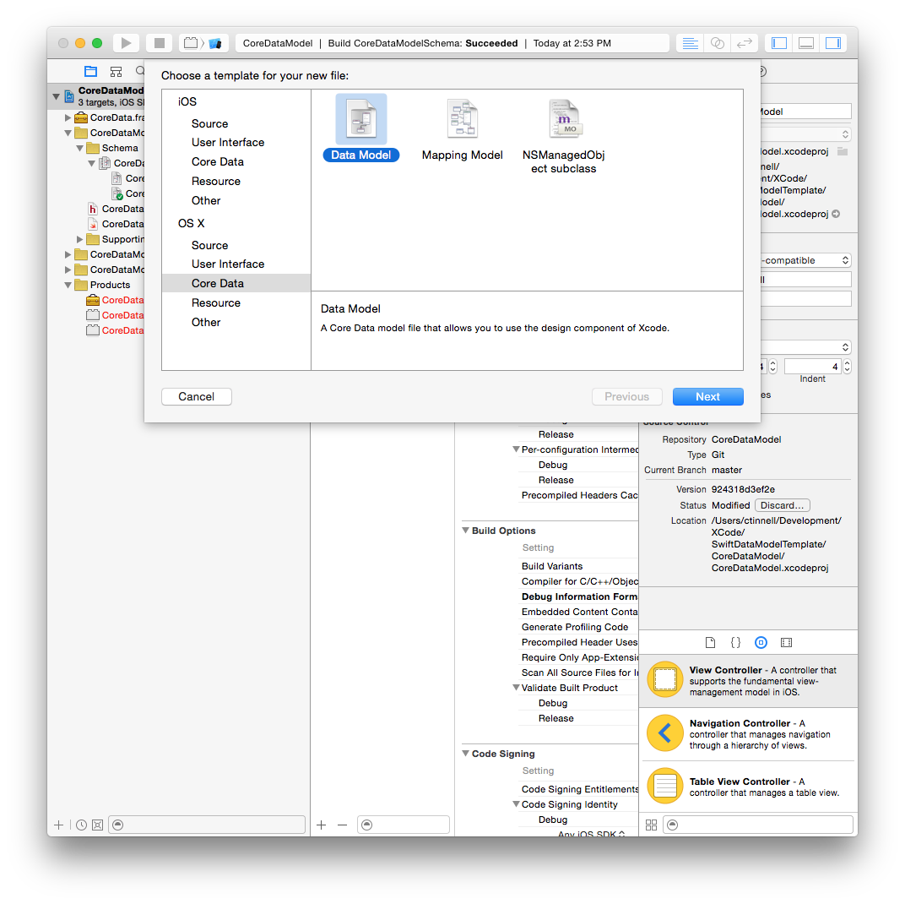
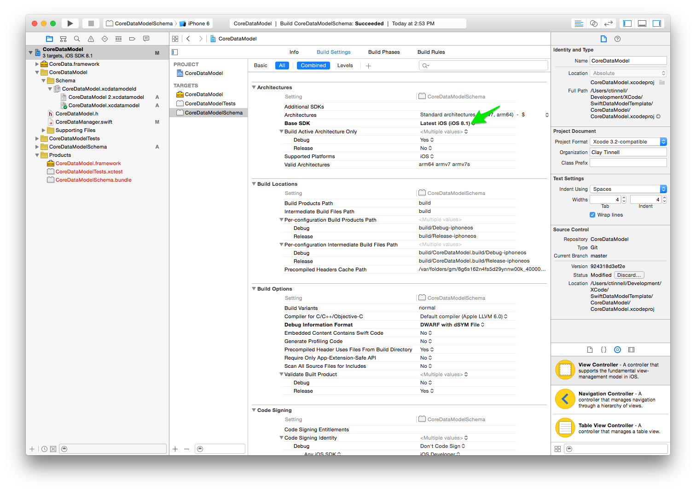
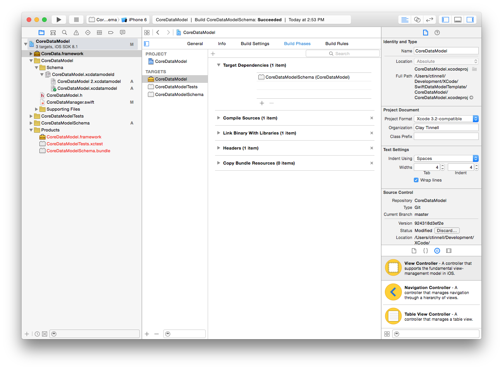

# CoreDataModel
Sample Core Data model framework in Swift.

## Usage
This will help you set up a Swift Core Data project using a reusable data model as a Framework. 
Either start with these projects as a base, or (recommended) go through the steps to set everything up along the way.

### Getting Started:

1. Create a new Swift Framework project:

2. Import Core Data Framework:

3. Copy CoreDataManager.swift into project.

4. Add a new Bundle target named CoreDataModelSchema. Yes... choose OSX instead of iOS.  We'll fix that later:

5. Create a new Core Data data model file and be certain to include it in the schema bundle target (not the framework).

6. Add a new model version since we are setting up a versioned data model.

7. Change the Base SDK from OSX to iOS.

8. Add a target dependency to your Framework so that the Bundle is built on Framework compile.

## License
Copyright (c) 2015 Clay Tinnell.

Use of the code provided on this repository is subject to the MIT License.

Permission is hereby granted, free of charge, to any person obtaining a copy of this software and associated documentation files (the "Software"), to deal in the Software without restriction, including without limitation the rights to use, copy, modify, merge, publish, distribute, sublicense, and/or sell copies of the Software, and to permit persons to whom the Software is furnished to do so, subject to the following conditions:

The above copyright notice and this permission notice shall be included in all copies or substantial portions of the Software.

THE SOFTWARE IS PROVIDED "AS IS", WITHOUT WARRANTY OF ANY KIND, EXPRESS OR IMPLIED, INCLUDING BUT NOT LIMITED TO THE WARRANTIES OF MERCHANTABILITY, FITNESS FOR A PARTICULAR PURPOSE AND NONINFRINGEMENT. IN NO EVENT SHALL THE AUTHORS OR COPYRIGHT HOLDERS BE LIABLE FOR ANY CLAIM, DAMAGES OR OTHER LIABILITY, WHETHER IN AN ACTION OF CONTRACT, TORT OR OTHERWISE, ARISING FROM, OUT OF OR IN CONNECTION WITH THE SOFTWARE OR THE USE OR OTHER DEALINGS IN THE SOFTWARE.

